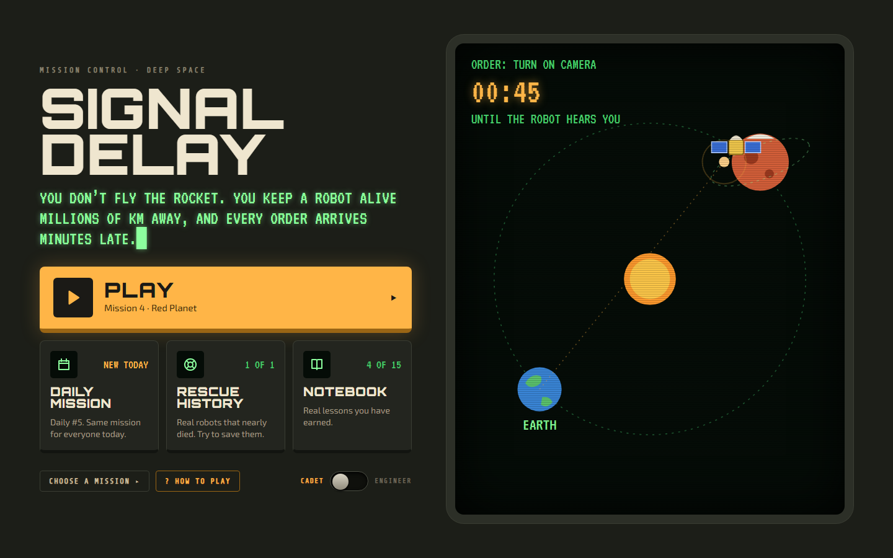
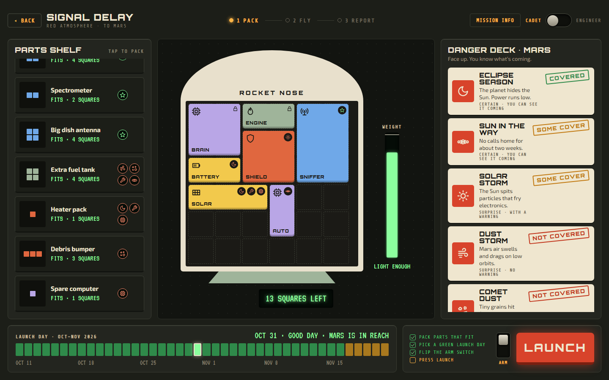
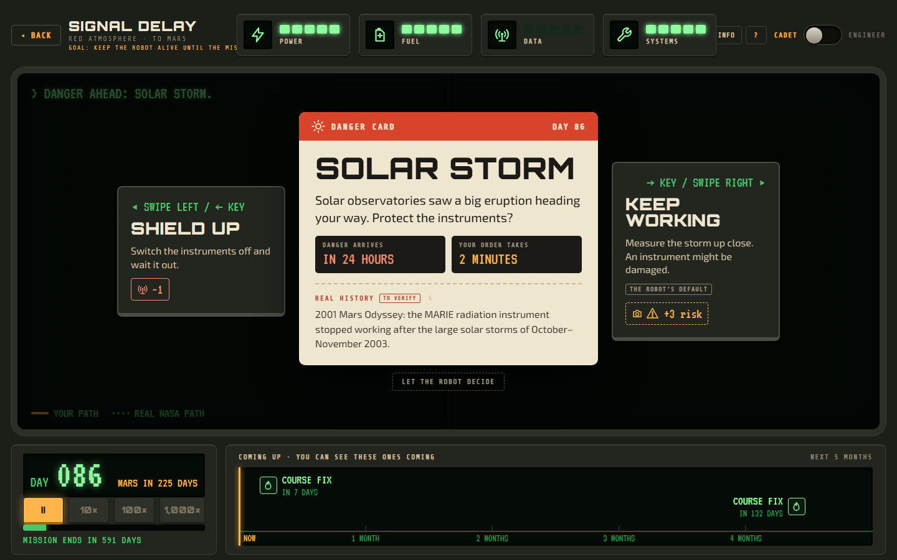
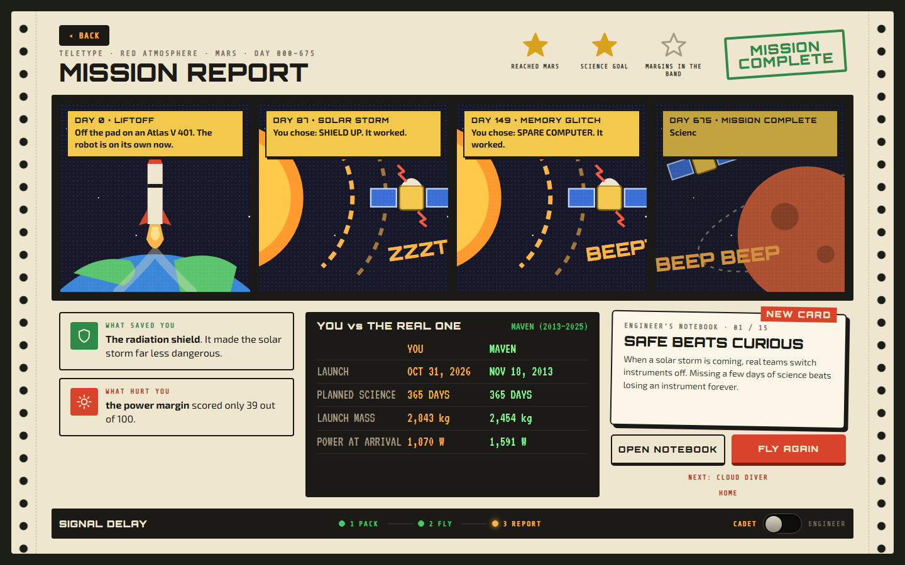

<div align="center">

# 🛰️ Signal Delay

### A deep-space mission game built on real NASA data and real orbital physics

*You don't fly the rocket. You keep a robot alive millions of kilometres away, and every order you send arrives minutes late.*

**[▶ Play in your browser](https://shariar165.github.io/space-mission-design-game-/)** · no install, no account

[](https://github.com/shariar165/space-mission-design-game-/actions/workflows/pages.yml)




</div>

---

## Contents

- [About the game](#about-the-game)
- [How to play](#how-to-play)
- [Real science, not invented numbers](#real-science-not-invented-numbers)
- [NASA data used in this game](#nasa-data-used-in-this-game)
- [Validation against real missions](#validation-against-real-missions)
- [Architecture](#architecture)
- [Getting started](#getting-started)
- [Project structure](#project-structure)
- [Known limitations](#known-limitations)
- [Contributing](#contributing)
- [Acknowledgements and disclaimer](#acknowledgements-and-disclaimer)
- [License](#license)

---

## About the game

**Signal Delay** is a browser game about the hardest part of robotic space exploration: you are not there. A spacecraft at Mars is between 3 and 22 light-minutes from Earth. When a solar storm is coming, the team on the ground has to decide, send the order, and hope it crosses space before the danger arrives.

The game turns the work of a NASA mission team into three steps:

1. **Pack.** Choose which parts fit in the rocket's nose and which dangers to prepare for.
2. **Fly & Survive.** The mission runs day by day. Danger cards stop the clock, you choose a response, and your order travels to the spacecraft at the speed of light.
3. **Mission Report.** Your flight is printed as a comic strip, scored, compared with the real NASA mission to the same place, and turned into a real engineering lesson.

It is designed for students and curious players first (**Cadet mode**), and for anyone who wants to see the physics underneath (**Engineer mode**, where every number can be opened to show its equation, its inputs and its source).

### What makes it different

- **Every number comes from physics or a cited source.** Distances come from JPL planetary positions, power from the inverse-square law calibrated on MAVEN, data rates from a link budget anchored to Mars Reconnaissance Orbiter, launch energy from a Lambert solver.
- **Real missions are flown through the same model as the player.** MAVEN and OSIRIS-REx are loaded as ordinary designs and must reproduce their published numbers. If the model can't, the model is fixed, not the mission.
- **Honest about guesses.** All physics and mission data are sourced. Values with no public source (failure chances, part costs, hazard rates) are labelled **game estimate** in the game itself and listed in [`TODO_DATA.md`](TODO_DATA.md).
- **Light delay is the core mechanic.** Commands obey `t = d / c` using the real Earth–spacecraft distance on that mission day. Solar conjunctions black out the radio for about two weeks, as they do for real Mars missions.

---

## How to play

<table>
<tr>
<td width="50%"></td>
<td width="50%"></td>
</tr>
<tr>
<td><b>Pack.</b> The nose is a 6 × 6 grid (volume) and the scale is the rocket's lift (weight): two separate limits. The danger deck shows what is coming at this destination, and the launch calendar shows which days the planets line up.</td>
<td><b>Fly & Survive.</b> A danger card shows when the danger arrives and how long your order takes to get there. Pick a response, or let the robot use its default.</td>
</tr>
</table>

<p align="center"></p>

### Missions

| # | Mission | Destination | What it teaches |
| --- | --- | --- | --- |
| 1 | First Light | Moon | Power: solar wings that keep the craft charged |
| 2 | Heavy Lifting | Moon | Fuel and weight: every kilogram of fuel must be lifted too |
| 3 | Full Build | Moon | Science and radio: build the whole craft |
| 4 | Red Planet | Mars | Light delay: too far to steer live |
| 5 | Cloud Diver | Venus | Budget: big radar, small wallet |
| 6 | Pebble Catcher | Bennu (asteroid) | Rendezvous and sample return |
| 7 | Giant Leap | Jupiter | Rocket limits: why real missions to Jupiter need gravity assists |

Each mission earns up to three stars: **reach the destination**, **meet the science goal**, and **keep every margin in the healthy 10–30% band**. One star opens the next mission.

### More ways to play

- **Daily mission.** The same Mars flight for every player each day, with a spoiler-free share card (like a word-puzzle grid).
- **Rescue History.** Investigate a real lost mission from its published failure report. The first case is Mars Climate Orbiter (1999), lost to a pound-force versus newton mix-up.
- **Engineer's Notebook.** Lessons unlocked by what you do in flight. Each one points at a real event already cited in the game's data.
- **Engineer mode.** Design the whole spacecraft in the Build Bay (bus, instruments, arrays or RTGs, antenna, engine, propellant, orbits, launch dates), then fly it with live readouts and an EQUATIONS drawer.

**Controls:** ← / → (or swipe) to choose a response, ↓ for a third option, `?` for help. Time runs at 10×, 100× or 1000× mission days a minute, and **FINISH MISSION** lets the robot fly the rest so every flight reaches the report.

---

## Real science, not invented numbers

The game follows three rules from its science specification ([`docs/SCIENCE_SPEC.md`](docs/SCIENCE_SPEC.md)):

1. **One model for everyone.** The player's craft and real missions run through the same equations.
2. **Sourced inputs.** Every constant and catalogue value is stored as a `Sourced<T>` record: value, unit, source, link, and an `isGameEstimate` flag. A test fails the build if any number in the data files is not wrapped this way.
3. **Show the working.** In Engineer mode every meter opens to its equation and inputs, and the ⓘ button shows where each input came from.

The interface never calculates anything. It asks the engine and only formats units, and an automated test rejects any digits typed into the UI.

The full rule book of the simulation (equations, constants, how hazards are drawn, how the score is computed) is in **[`game_engine.md`](game_engine.md)**.

---

## NASA data used in this game

All values below are stored in `src/data/*.json` or `src/engine/*.ts` with their source and link, and can be opened in the game with ⓘ.

### Planets, the Moon and Bennu

| Data | Used for | Source |
| --- | --- | --- |
| Mars semimajor axis, orbit and synodic periods, radius, GM, distance from Earth (54.6–401.4 million km), solar irradiance, pole of rotation | Mars orbit, light delay, power, eclipses, dust-storm season | [NASA NSSDC Mars Fact Sheet](https://nssdc.gsfc.nasa.gov/planetary/factsheet/marsfact.html) |
| Earth GM, equatorial radius, sidereal year; solar irradiance at 1 AU (1361 W/m²) | Launch and power calculations | [NASA NSSDC Earth/Mars Fact Sheets](https://nssdc.gsfc.nasa.gov/planetary/factsheet/marsfact.html) |
| Venus GM, radius, solar irradiance (2601.3 W/m²), pole of rotation | Venus missions | [NASA NSSDC Venus Fact Sheet](https://nssdc.gsfc.nasa.gov/planetary/factsheet/venusfact.html) |
| Jupiter GM, radius, solar irradiance (50.26 W/m²), pole of rotation | Jupiter missions | [NASA NSSDC Jupiter Fact Sheet](https://nssdc.gsfc.nasa.gov/planetary/factsheet/jupiterfact.html) |
| Moon semimajor axis, orbit period, GM, radius | Lunar missions | [NASA NSSDC Moon Fact Sheet](https://nssdc.gsfc.nasa.gov/planetary/factsheet/moonfact.html) |
| Orbit and size summary for all destinations | Destination catalogue | [NASA Planetary Fact Sheet](https://nssdc.gsfc.nasa.gov/planetary/factsheet/index.html) |
| Keplerian elements and rates, Table 1 (1800–2050) for Earth–Moon barycentre, Venus, Mars, Jupiter; obliquity at J2000 | Planet positions on every mission day | [JPL Approximate Positions of the Planets](https://ssd.jpl.nasa.gov/planets/approx_pos.html) |
| 101955 Bennu osculating elements (orbit solution 118) and GM | Asteroid position and rendezvous | [JPL Small-Body Database](https://ssd.jpl.nasa.gov/tools/sbdb_lookup.html#/?sstr=101955) |
| Mars perihelion solar longitude, Lₛ = 251.000° + 0.0064891° × (year − 2000) | Mars seasons and dust storms | [NASA GISS Mars24 technical notes](https://www.giss.nasa.gov/tools/mars24/help/notes.html) |

### Real missions

| Mission | Data used | Source |
| --- | --- | --- |
| **MAVEN** (Mars, 2013–2025) | 2,454 kg wet / 809 kg dry, hydrazine, 12 m² arrays producing 1,150–1,700 W, 2 m high-gain antenna, 65 kg science payload, Atlas V 401, launch Nov 18 2013, orbit insertion Sept 21 2014 | [NASA Science: MAVEN](https://science.nasa.gov/mission/maven/) |
| | Capture orbit (35 h, 380 km), science orbit (150 × 6,300 km, 4.5 h), insertion burn uses more than half the fuel, one-year prime mission | [NASAfacts: MAVEN Orbit Insertion](https://science.nasa.gov/wp-content/uploads/2024/03/44740_MAVEN-Fact-Sheet.pdf) |
| | Launch period Nov 18 – Dec 7 2013, planned insertion Sept 22 2014 | [NASA: The 2013 MAVEN Mission to Mars](https://mars.nasa.gov/files/resources/MAVENPresentation2013.pdf) |
| | Science orbit inclination 75° | [L. J. Wood, AAS 21-211 (JPL DESCANSO)](https://descanso.jpl.nasa.gov/evolution/AAS%2021-211.pdf) |
| **OSIRIS-REx** (Bennu, 2016) | Launch Sept 8 2016, launch C3 = 29.29678 km²/s², 2,105 kg, Earth flyby route, deep-space manoeuvre Dec 28 2016, approach Aug 13 2018, 1,226–2,500 W arrays, hydrazine | [Lauretta et al. 2017, OSIRIS-REx mission description (arXiv 1702.06981)](https://arxiv.org/pdf/1702.06981) |
| **LRO and LCROSS** (Moon, 2009) | LRO 1,850 kg on Atlas V 401 AV-020, June 18 2009; LCROSS as the secondary payload, limited to 1,000 kg fuelled | [NASA Science: LRO](https://science.nasa.gov/mission/lro/about/), [NASA Science: LCROSS](https://science.nasa.gov/mission/lcross/), [NTRS 20100028203](https://ntrs.nasa.gov/citations/20100028203) |
| **Juno** (Jupiter, 2011) | Atlas V launch Aug 5 2011, Earth flyby 26 months later, Jupiter arrival July 4 2016 (the "Giant Leap" lesson) | [NASA Science: Juno](https://science.nasa.gov/mission/juno/) |
| **Mars Climate Orbiter** (1999) | Launch, masses, solar array, main engine, arrival distance and light time | [NASA/JPL MCO Arrival press kit](https://mars.nasa.gov/internal_resources/812/), [NASA Science: MCO](https://science.nasa.gov/mission/mars-climate-orbiter/) |
| | Root cause (impulse in lbf·s instead of N·s), planned 226 km periapsis, 80 km survivable, 57 km actual, contributing causes | [MCO Mishap Investigation Board Phase I Report](https://discovery.larc.nasa.gov/PDF_FILES/MCO_report_2.pdf) |

### Spacecraft systems, communications and operations

| Data | Used for | Source |
| --- | --- | --- |
| MMRTG: about 110 W at launch, about 45 kg | Nuclear power option | [NASA MMRTG fact sheet](https://science.nasa.gov/wp-content/uploads/2024/02/mmrtg-factsheet-updated-5-18-20-1.pdf) |
| Li-ion cycle life at 30% depth of discharge | Battery sizing rule | [JPL D-101146, Energy Storage Technologies for Future Planetary Science Missions](https://solarsystem.nasa.gov/system/downloadable_items/716_Energy_Storage_Tech_Report_FINAL.PDF) |
| MRO X-band design point: ≥ 500 kbps at 400 million km, 100 W TWTA, 3 m antenna | Anchor of the communications model | [DESCANSO Article 12: MRO Telecommunications](https://descanso.jpl.nasa.gov/DPSummary/MRO_092106.pdf) |
| DSN X-band receive gains: 70 m (74.55 dBi) and 34 m BWG (68.24 dBi) | Small vs big dish data rates | [DSN 810-005 module 101](https://deepspace.jpl.nasa.gov/dsndocs/810-005/101/101I.pdf), [module 104](https://deepspace.jpl.nasa.gov/dsndocs/810-005/104/104Q.pdf) |
| DSN aperture fee formula, $1,057/h (FY09), aperture weights 1 (34 m) and 4 (70 m), pass set-up and tear-down | Cost of booking a call home | [NASA Mission Operations and Communications Services (JPL D-22674)](https://deepspace.jpl.nasa.gov/files/6_NASA_MOCS_2014_10_01_14.pdf) |
| No commanding while the Sun is within 2° of Mars in Earth's sky | Solar conjunction blackouts | [JPL news, 2015](https://www.jpl.nasa.gov/news/mars-missions-to-pause-commanding-in-june-due-to-sun/) |
| Discovery cost cap, $500M (FY2019), excluding launch and operations | Mission budget | [NASA Discovery 2019 AO overview](https://discovery.larc.nasa.gov/PDF_FILES/03a_Brown_Overview.pdf) |
| Payload vs launch energy (C3) curves for Atlas V 401 and 411 | Rocket lift | [NASA Launch Services Program performance site](https://elvperf.ksc.nasa.gov/) (see the note below) |

### Space weather and Mars dust storms

| Data | Used for | Source |
| --- | --- | --- |
| Strong (S3) and severe (S4) solar radiation storms: 10 + 3 per 11-year cycle | Solar storm hazard rate | [NOAA Space Weather Scales](https://www.spaceweather.gov/noaa-scales-explanation) |
| Solar cycle 24 (minimum Dec 2008, maximum Apr 2014) and cycle 25 (minimum Dec 2019, maximum Oct 2024) | Storms are likelier near solar maximum | [NOAA SWPC](https://www.swpc.noaa.gov/news/sun-solar-maximum-solar-cycle-24-seeing-second-higher-peak-sunspot-number-updated), [NASA/NOAA 2024](https://science.nasa.gov/science-research/heliophysics/nasa-noaa-sun-reaches-maximum-phase-in-11-year-solar-cycle/) |
| Global dust storms about once every three Mars years | Mars dust-storm hazard rate | [NASA: The Fact and Fiction of Martian Dust Storms](https://www.nasa.gov/solar-system/the-fact-and-fiction-of-martian-dust-storms/) |

### Live NASA data

Two features follow the real sky day by day. Both stay deterministic and fully tested.

| Feature | Data | How it works | Source |
| --- | --- | --- | --- |
| **Mars right now** (Home) | Today's Earth–Mars distance, one-way light time (d / c), and the next solar conjunction (Sun within 2° of Mars in Earth's sky) with its closest day | Computed in the browser from the JPL approximate elements above, for today's date. No API call. The closest day of the Jan 2026 conjunction (computed: Jan 9) falls inside NASA's published commanding pause, Dec 29, 2025 – Jan 16, 2026 | [JPL Approximate Positions of the Planets](https://ssd.jpl.nasa.gov/planets/approx_pos.html), [NASA MAVEN blog, Dec 2025](https://science.nasa.gov/blogs/maven/2025/12/23/nasa-works-maven-spacecraft-issue-ahead-of-solar-conjunction/) |
| **The Daily's real Sun** | NASA DONKI solar flares (FLR) and coronal mass ejections (CME) from the 7 whole UTC days before today | See the steps below the table | [CCMC DONKI-API](https://ccmc.gsfc.nasa.gov/news/major-updates/) (base `https://ccmc.gsfc.nasa.gov/DONKI-API/get/`, no API key), [NOAA flare classes](https://www.swpc.noaa.gov/phenomena/solar-flares-radio-blackouts) |

How the Daily's real Sun works:
1. **The snapshot.** A GitHub Action ([`donki.yml`](.github/workflows/donki.yml)) runs daily at 00:20 UTC. It saves the week as [`public/data/donki-latest.json`](public/data/donki-latest.json), with the fetch time and source URLs, and redeploys. The game reads only that file and never calls NASA from your browser.
2. **Which events become storm cards.** M- and X-class flares (≥ 10⁻⁵ W/m²) and CMEs at ≥ 1,000 km/s. A flare and a CME that DONKI links count as one storm. The 4 strongest are kept.
3. **When they strike.** The real week is replayed across your flight: an event a fraction f into the week strikes the same fraction of the way from the start of cruise to the end of the prime mission.
4. **What you see.** Each storm card names the real event, and its ⓘ opens the DONKI record.
5. **The seed.** It is the date plus the DONKI event IDs, so everyone with the same snapshot flies the same Daily.
6. **When the file can't be used.** If it is missing, unreadable or more than 2 days old, the Daily flies seeded storms and says **"offline — simulated weather"**.
7. **The game rules.** The thresholds, the cap of 4, the 7-day window and the 2-day staleness limit are game rules, listed in [`TODO_DATA.md`](TODO_DATA.md).

DONKI moved from `api.nasa.gov` to CCMC on Sept 30, 2026; the old URLs now redirect to CCMC's announcement.

### Physical constants

Standard gravity, speed of light (SI definitions), the astronomical unit (IAU 2012), and the unit conversion behind the Mars Climate Orbiter case ([NIST SP 811](https://www.nist.gov/pml/special-publication-811)).

> **Note on data quality.** Some NSSDC fact sheets were read from Internet Archive copies (Sept 28 – Oct 3, 2026) because the live site refused connections; each record says so. The **Atlas V payload curves are placeholders**: NASA's LSP site is an interactive tool that can't be exported by script, so the launch-capacity checks are not yet real evidence. The real-history texts on danger cards are marked **"to verify"** until checked against NASA's Lessons Learned system or official failure reports. Everything without a public source (failure chances, part costs, hazard rates, Isp ranges) is a labelled **game estimate**, listed in [`TODO_DATA.md`](TODO_DATA.md).

---

## Validation against real missions

`tests/validation.test.ts` loads real missions as ordinary player designs and checks the engine against independent published values (±10%). The full, auto-generated table is in [`docs/VALIDATION_RESULTS.md`](docs/VALIDATION_RESULTS.md). Highlights:

| Check | Engine | Published | Result |
| --- | --- | --- | --- |
| MAVEN Δv capability (rocket equation) | 2,449 m/s | ≈ 2,450 m/s | ✅ −0.1% |
| MAVEN transfer time (best Lambert arrival) | 300 days | 307 days | ✅ −2.3% |
| MAVEN best launch date lies in the published launch period | Dec 6, 2013 | Nov 18 – Dec 7, 2013 | ✅ |
| MAVEN science-orbit period from published altitudes | 4.5 h | 4.5 h | ✅ |
| MAVEN insertion burn uses more than half the propellant | 60% | > 50% | ✅ |
| Mars solar conjunctions 2015, 2017, 2019 (centre of the command moratorium) | within 0.6 days | JPL moratorium dates | ✅ |
| 2015 conjunction blackout length at 2° | 13.9 days | 14 days | ✅ |
| Mars perihelion Lₛ (2022) | 251.15° | 251.15° (Mars24) | ✅ |
| MAVEN solar power at perihelion / aphelion | 1,712 W / 1,177 W | 1,700 W / 1,150 W | calibration* |

\* The system efficiency η = 0.20 was fitted to these MAVEN figures, so agreement is by construction and is labelled *calibration*, not evidence. The rule for this project: when a validation check fails, the model or data is fixed, never the expected value.

---

## Architecture

```
src/data/*.json  ──►  src/engine (pure TypeScript)  ──►  src/ui (React + Vite)
 Sourced values        physics, missions, operations       displays only, formats units
```

- **Engine** (`src/engine`): no UI imports, fully unit-tested. `evaluateDesign` sizes a design (trajectory, power, batteries, mass, Δv, launch, comms, cost). The Mission Operations engine (`src/engine/ops`) flies it day by day with seeded hazards, light-delayed commands, DSN bookings, eclipses and conjunctions.
- **UI** (`src/ui`): React 19 screens built from the Claude Design "Signal Delay" mockups (`docs/design/signal-delay/`). The Risk meter's 500-run Monte Carlo runs in a Web Worker.
- **Deterministic:** a mission is a function of (design, seed, command log), so any flight can be replayed exactly.

| Area | Technology |
| --- | --- |
| Language | TypeScript 7 (strict, `noUncheckedIndexedAccess`) |
| UI | React 19, Vite 8, plain CSS with design tokens |
| Tests | Vitest 5, Testing Library + jsdom, Playwright screenshots |
| Hosting | GitHub Pages via GitHub Actions (tests must pass before deploy) |

See [`game_engine.md`](game_engine.md) for the engine rules and [`docs/SCIENCE_SPEC.md`](docs/SCIENCE_SPEC.md) for the full specification and decision log.

---

## Getting started

Everything, including Node itself, lives in a Python virtual environment, so nothing is installed globally. Node 22.16.0 is placed inside `.venv` by [nodeenv](https://github.com/ekalinin/nodeenv).

```powershell
python -m venv .venv
.\.venv\Scripts\python -m pip install -r requirements.txt
.\.venv\Scripts\nodeenv -p --node=22.16.0   # puts node/npm into .venv\Scripts
.\.venv\Scripts\Activate.ps1                # Git Bash: export PATH="$PWD/.venv/Scripts:$PATH"
npm install
npm run dev                                 # http://localhost:5173
```

| Command | What it does |
| --- | --- |
| `npm run dev` | Start the game at http://localhost:5173 |
| `npm run build` | Typecheck, then build the static site into `dist/` |
| `npm test` | All tests: physics, validation, data audit, engine API, UI guards, component tests |
| `npx vitest run tests/ui` | Component tests only |
| `npm run test:validation` | Real-mission validation; rewrites `docs/VALIDATION_RESULTS.md` |
| `npm run todo-data` | Data audit; rewrites `TODO_DATA.md` |
| `npm run typecheck` | `tsc --noEmit` |
| `npm run shots` | Playwright screenshots at 1440 × 900 and 390 × 844 (browsers live in `.venv/ms-playwright`) |

Every push to `main` runs the tests, builds with the Pages base path and publishes to GitHub Pages.

---

## Project structure

```
src/
  data/            Sourced catalogues: destinations, orbitalElements, launchVehicles, rideshares, parts,
                   missions, hazards, operations, pack, crisisCards, lessons, rescueCases, notebook
  engine/          Simulation engine (pure TypeScript, no UI)
    ephemeris.ts   JPL approximate planet positions; Bennu from the JPL SBDB
    trajectory.ts  Hohmann, Lambert, capture Δv, orbit changes, launch windows
    propulsion.ts  rocket equation, Δv budget
    launch.ts      payload(C3) curves, rideshare, launch reliability
    power.ts       solar and RTG power, eclipses, batteries
    comms.ts       scaled link budget (MRO anchor, DSN gains), light delay
    massCost.ts    mass roll-up, cost against the mission-class cap
    risk.ts / scoring.ts   margins → risk → score and stars
    index.ts       evaluateDesign, simulateMission, monteCarloMission
    ops/           Mission Operations: day-by-day clock, hazards, commands, DSN, extension,
                   Fly & Survive view (fly.ts) and Mission Report (report.ts)
    pack.ts / daily.ts / notebook.ts / rescue.ts   game modes
  ui/              React screens (Home, Pack, FlyAndSurvive, MissionReport, Daily, Notebook,
                   Rescue, BuildBay), components, words (sdWords.ts), styles
tests/             physics, validation, data audit, engine API, UI guards, ui/ component tests,
                   visual/ Playwright screenshot specs
docs/              SCIENCE_SPEC.md, VALIDATION_RESULTS.md, design/ (mockup copies), images/
```

---

## Known limitations

The models are simplified on purpose, using the standard first-order methods of early mission concept studies. The main limits:

- **Patched conics and a zero-revolution Lambert solver.** Gravity assists are not simulated. Direct transfers are capped below twice the Hohmann time (518 days to Mars, 399 to Bennu). The real OSIRIS-REx route is offered as a fixed, labelled option.
- **Approximate ephemeris.** JPL's approximate elements (valid 1800–2050), the Earth–Moon barycentre for Earth, and two-body propagation for Bennu.
- **Communications.** Close-range data rates are optimistic, because coding and decoder caps aren't modelled. The 34 m station behind MRO's anchor figure is inferred.
- **Operations.** Science orbits are fixed in inertial space (no J2 precession), shadows are cylindrical, hazards are independent Poisson processes, and the Moon has no conjunctions.
- **Placeholder launch curves** for the Atlas V, as noted above.
- **The live Daily** uses that day's DONKI snapshot. DONKI sometimes adds or revises records later, and a snapshot deployed mid-day can differ from the morning's. Each browser keeps the first snapshot it reads for the whole day. Players without the file fly the offline Daily, which has different storms. The storm cards are real events replayed on a game timeline; the model does not predict how a CME propagates.
- **Scoring** uses `Σ wᵢsᵢ` on a 0–100 scale (the spec's `100 Σ wᵢsᵢ` was read this way).

The full list is in the *Assumptions* section of [`docs/SCIENCE_SPEC.md`](docs/SCIENCE_SPEC.md) and in [`game_engine.md`](game_engine.md).

---

## Contributing

The most valuable contributions are **better sources**:

- Export the NASA LSP payload-vs-C3 points for the Atlas V 401 and 411 into `src/data/launchVehicles.json`.
- Replace a game estimate in [`TODO_DATA.md`](TODO_DATA.md) with a published NASA value (and set `isGameEstimate: false`).
- Check a danger card's real-history text against NASA's [Lessons Learned Information System](https://llis.nasa.gov/) or the official failure report.

Code rules: write the physics test first (with the hand calculation in a comment), wrap every new value in `Sourced<T>`, keep numbers out of the UI, and run `npm test` before opening a pull request.

---

## Acknowledgements and disclaimer

This game is built on public data from NASA, JPL, the NSSDC, the Deep Space Network, NOAA and the published literature cited above. Thanks to the scientists and engineers whose fact sheets, mission papers and failure reports make a game like this possible.

**Signal Delay is an independent educational project. It is not affiliated with, sponsored by or endorsed by NASA, JPL or NOAA.** It does not use the NASA insignia or logotype. Mission names are used only to identify the real missions whose published data the game cites. The game's results are simplified models for learning, not mission analysis.

## License

The code is released under the [MIT License](LICENSE). Teachers and students may use, copy and adapt it freely. The NASA pictures in `public/postcards/` are public domain (see `src/data/postcards.json`), and NASA's own data keep their original terms.
